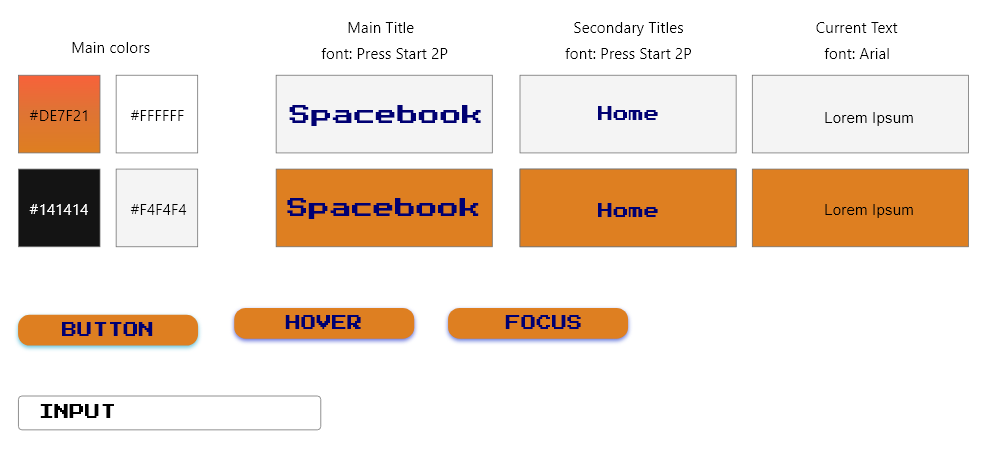
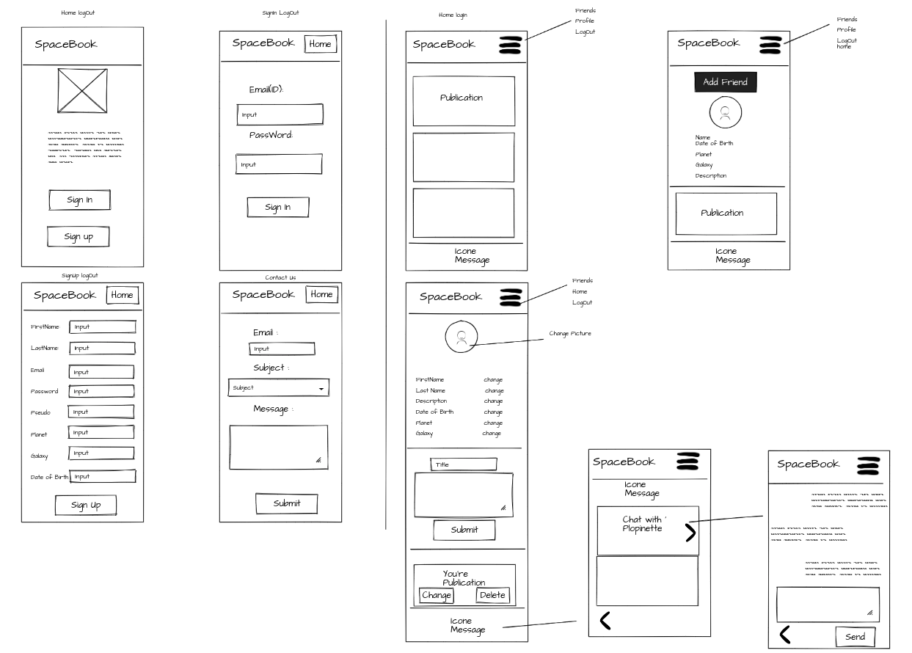
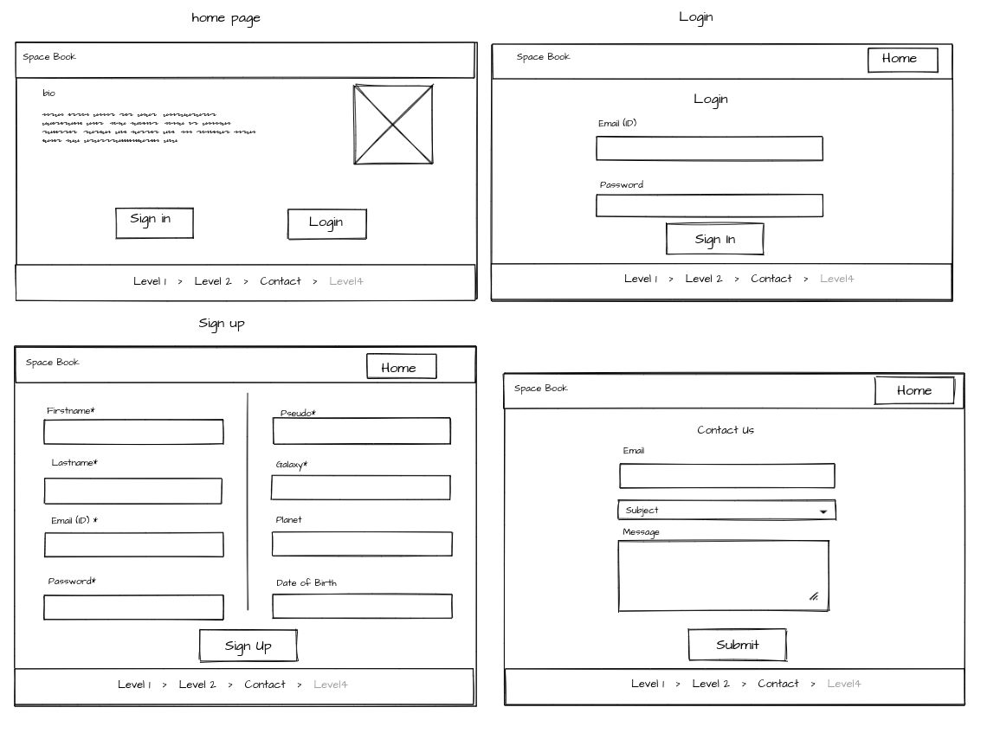
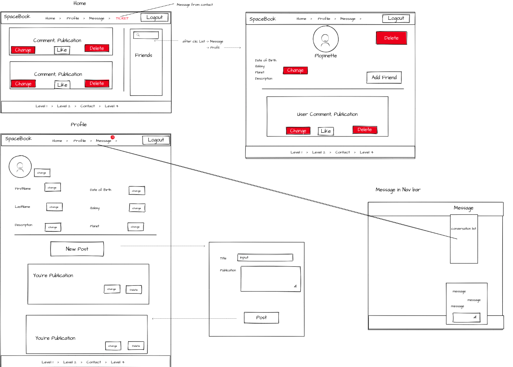

# Space Book Project

##### Inter-galactic social network.

## The Team

* Anne Lozier | [Github](https://github.com/aloz-lab)
* Jules Dumas | [Github](https://github.com/juliusDum)
* Guillaume Del Vecchio | [Github](https://github.com/GuillaumeDV)
* Jimmy Boucaud | [Github](https://github.com/Jimbeck2403)
* Aurélien André | [Github](https://github.com/Krilline)

## Technos

* HTML
* CSS
* PHP
* Twig

## Functionalities 

* Nav-bar(Logged out)
    * Website Title
    * Home link
* Nav-bar(Logged)
    * Website Title
    * Home link
    * Profile link
    * Message link
    * Add User link
    * Logout
* Home Page(Logged out)
    * Website's Biography
    * Website's Resume
    * Sign up button
    * Login button
* Home Page(Logged)
    * Friends posts
        * Like post
        * Comments post
* Profile Page
    * User informations
        * Edit profile
        * Delete profile
    * Show posts button
        * Add post
        * Edit post
        * Delete post
    * See friends button
        * Delete friend
* Message Page
    * Users messages
        * Add message
* Add User Page
    * Add user as friend
* Footer
    * Contact Us
        * Send support message
    * Copyrights
        * Secret links to admin panel
            * Delete users
            * Delete posts
                * Delete comments
            * Manage support tickets
## Graphic Chart

## Mobile WireFrame

## Desktop WireFrame

